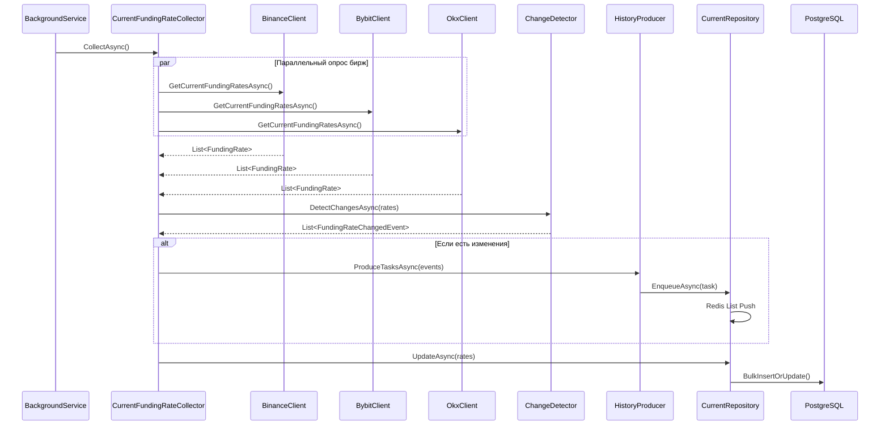
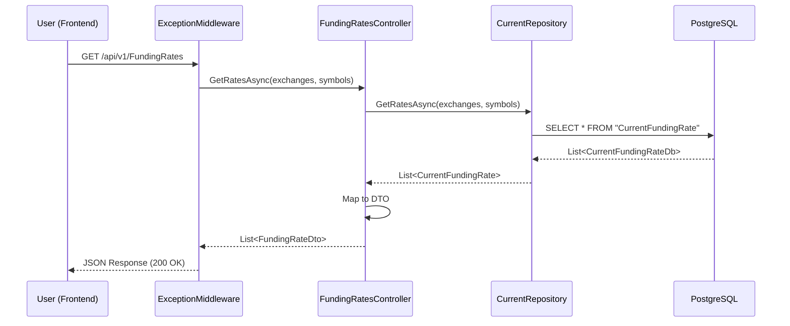
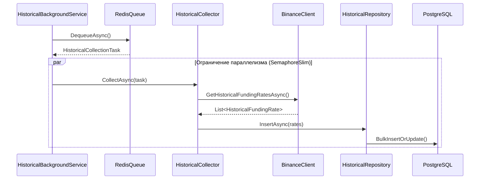
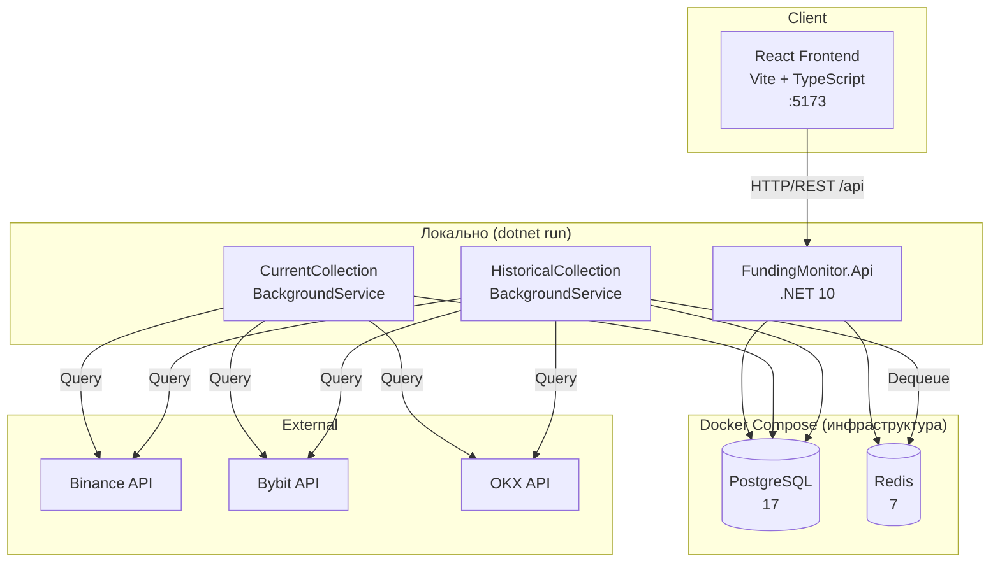

# Диаграмма использования FundingMonitor

## Use Case Diagram

```plantuml
left to right direction
skinparam packageStyle rectangle
skinparam actorStyle awesome

actor "Пользователь (трейдер)" as User

rectangle "Система мониторинга арбитражных возможностей\nна криптовалютных биржах" {

    ' === Выбор параметров (основные действия пользователя) ===
    usecase "Выбор бирж для\nмониторинга" as UC1
    usecase "Выбор криптовалют\n(символов)" as UC2

    ' === Автоматическое отображение данных на основе выбора ===
    usecase "Просмотр текущих ставок\nфинансирования" as UC3
    usecase "Просмотр арбитражных\nвозможностей" as UC4
    usecase "Просмотр исторических\nданных" as UC5

    ' === Детализация исторических данных ===
    usecase "Настройка периода\nотображения" as UC12
    usecase "Визуализация графиков" as UC13
    usecase "Просмотр APR-статистики" as UC14
}

' === Связи актера с основными вариантами использования (ВЫБОР) ===
User -- UC1 : "Выбирает"
User -- UC2 : "Выбирает"

' === Выбор влияет на отображение данных ===
UC1 ..> UC3 : <<include>>
UC1 ..> UC4 : <<include>>
UC1 ..> UC5 : <<include>>
UC2 ..> UC3 : <<include>>
UC2 ..> UC4 : <<include>>
UC2 ..> UC5 : <<include>>


' === Детализация исторических данных ===
UC5 -- UC12
UC5 -- UC13
UC5 -- UC14
UC12 .> UC5 : <<extend>>
UC13 .> UC5 : <<extend>>
UC14 .> UC5 : <<extend>>
```

## Детальное описание сценариев использования

### 1. Пользовательские сценарии (Frontend → API)

| ID      | Сценарий                          | Actor        | Описание                                                                |
| ------- | --------------------------------- | ------------ | ----------------------------------------------------------------------- |
| **UC1** | Получить текущие ставки           | Пользователь | GET `/api/v1/FundingRates` - получение актуальных ставок по всем биржам |
| **UC2** | Получить исторические данные      | Пользователь | GET `/api/v1/History` - получение истории ставок за период              |
| **UC3** | Получить APR статистику           | Пользователь | GET `/api/v1/History/apr-stats` — расчёт APR за 1/2/3/7/14/21/30 дней |
| **UC4** | Проверить доступность бирж        | Пользователь | GET `/api/v1/exchanges/health` — проверка доступности API бирж          |
| **UC5** | Просмотр арбитражных возможностей | Пользователь | GET `/api/v1/Arbitrage` — разницы ставок между биржами, сортировка по APR |

### 2. Фоновые сценарии (Background Services)

| ID       | Сценарий                       | Actor   | Описание                                                                                |
| -------- | ------------------------------ | ------- | --------------------------------------------------------------------------------------- |
| **UC10** | Сбор текущих ставок            | Система | `CurrentCollectionBackgroundService` - опрос бирж каждые 10 секунд                      |
| **UC11** | Детектирование изменений       | Система | `FundingRateChangeDetector` - обнаружение новых символов или изменений времени выплаты  |
| **UC12** | Создание задач сбора истории   | Система | `HistoricalCollectionProducer` - создание задач для Redis очереди при изменении ставок  |
| **UC13** | Сбор исторических данных       | Система | `HistoricalCollectionBackgroundService` - обработка очереди с ограничением параллелизма |
| **UC14** | Поиск арбитражных возможностей | Система | `FundingArbitrageDetector` + `FundingArbitrageService` — анализ разниц ставок между биржами |
| **UC15** | Расчёт APR статистики          | Система | `AprStatsService` - вычисление годовой процентной ставки с кэшированием                 |

### 3. Инфраструктурные сценарии

| ID       | Сценарий                 | Actor   | Описание                                                         |
| -------- | ------------------------ | ------- | ---------------------------------------------------------------- |
| **UC20** | Сохранение в PostgreSQL  | Система | EF Core Bulk Extensions для эффективной записи данных            |
| **UC21** | Очередь задач Redis      | Система | Персистентная очередь для надёжного хранения задач сбора истории |
| **UC22** | Получение данных Binance | Система | Binance.Net API - получение текущих и исторических ставок        |
| **UC23** | Получение данных Bybit   | Система | Bybit.Net API - получение текущих и исторических ставок          |
| **UC24** | Получение данных OKX     | Система | JK.OKX.Net API - получение текущих и исторических ставок         |

## Sequence Diagram - Сбор текущих данных



## Sequence Diagram - API запрос



## Sequence Diagram - Сбор исторических данных



## Компонентная диаграмма

```mermaid
classDiagram
    class "FundingMonitor.Api" {
        +FundingRatesController
        +HistoryController
        +ArbitrageController
        +ExchangesController
        +ExceptionHandlingMiddleware
        +DTOs
    }

    class "FundingMonitor.Application" {
        +CurrentFundingRateCollector
        +HistoricalFundingRateCollector
        +FundingRateChangeDetector
        +HistoricalCollectionProducer
        +AprStatsService
        +FundingArbitrageDetector
        +FundingArbitrageService
        +CurrentCollectionBackgroundService
        +HistoricalCollectionBackgroundService
    }

    class "FundingMonitor.Core" {
        +CurrentFundingRate (Entity)
        +HistoricalFundingRate (Entity)
        +ICurrentFundingRateRepository
        +IHistoricalFundingRateRepository
        +FundingRateChangedEvent
    }

    class "FundingMonitor.Infrastructure" {
        +FundingMonitorDbContext
        +CurrentFundingRateRepository
        +HistoricalFundingRateRepository
        +BinanceFundingRateClient
        +BybitFundingRateClient
        +OkxFundingRateClient
        +RedisHistoryTaskQueue
    }

    class "External Services" {
        <<external>>
        Binance API
        Bybit API
        OKX API
    }

    class "Data Stores" {
        <<database>>
        PostgreSQL
        Redis
    }

    FundingMonitor.Api --> FundingMonitor.Application
    FundingMonitor.Application --> FundingMonitor.Core
    FundingMonitor.Infrastructure --> FundingMonitor.Core
    FundingMonitor.Api --> FundingMonitor.Infrastructure
    FundingMonitor.Infrastructure --> "External Services"
    FundingMonitor.Infrastructure --> "Data Stores"
```

## Развёртывание (локальная разработка)



## Сводная таблица акторов и сценариев

| Актор                             | Сценарии использования             |
| --------------------------------- | ---------------------------------- |
| **Пользователь (Frontend)**       | UC1, UC2, UC3, UC4, UC5, UC6       |
| **Система (Background Services)** | UC10, UC11, UC12, UC13, UC14, UC15 |
| **Внешние биржи**                 | UC22, UC23, UC24                   |
| **PostgreSQL**                    | UC20                               |
| **Redis**                         | UC21                               |
